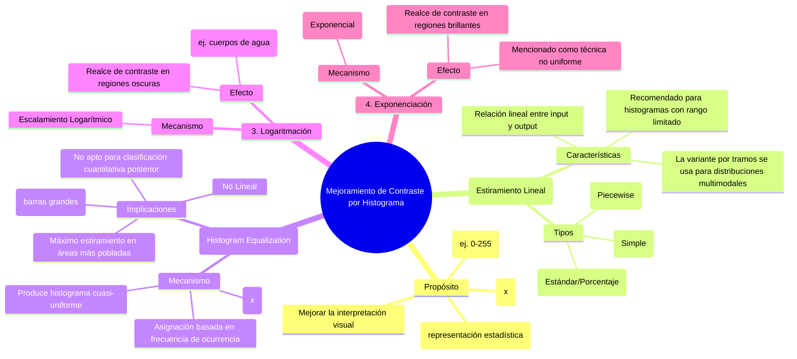

## Técnicas de Mejoramiento de Contraste por Manipulación del Histograma

### Introducción

El procesamiento digital de imágenes, particularmente en campos como la Geomática y la Teledetección, depende fundamentalmente de la capacidad para interpretar la información espectral registrada por los sensores. Las imágenes satelitales o aéreas a menudo presentan un contraste deficiente, utilizando solo una fracción del rango dinámico total disponible en el dispositivo de visualización (por ejemplo, 8 bits, 0-255). Las técnicas de **mejoramiento de contraste** están diseñadas para facilitar la interpretación humana, extendiendo (o "estirando") el intervalo de niveles de gris grabados en la imagen original para cubrir la totalidad del rango dinámico del instrumento de visualización.

Estas técnicas se basan en el estudio y la manipulación del histograma de la imagen, que es una representación estadística que caracteriza el contenido de los niveles de gris sin proporcionar información sobre su distribución espacial. La modificación del contraste se describe matemáticamente como una función de transformación $y = f(x)$, donde $x$ es el valor de brillo original e $y$ es el nuevo valor de brillo.

A continuación, se presenta un análisis formal y detallado de las principales técnicas de mejoramiento de contraste por manipulación del histograma: Linearización, Ecualización, Exponenciación y Logaritmación.

### 1. Linearización (Estiramiento Lineal de Contraste)

La linearización (o estiramiento lineal de contraste) es el método más directo y común para mejorar el contraste. Su objetivo es expandir un rango limitado de valores de brillo originales a todo el rango dinámico del dispositivo de visualización.

#### Tipos de Linearización

1.  **Estiramiento Lineal Mínimo-Máximo (Simple):**
    Esta técnica simple identifica el valor de brillo mínimo ($min_k$) y máximo ($max_k$) de la banda $k$ en la imagen y los mapea a los valores extremos del rango de visualización (por ejemplo, 0 y 255). Este proceso asegura que el rango completo se utilice, lo que resulta en una visualización más útil para la interpretación.

2.  **Estiramiento Lineal Saturado (Porcentaje Estándar):**
    Frecuentemente, se logra un mejor producto visual al saturar hasta cierto punto los extremos blancos y negros del histograma. Este método se emplea para expandir un rango restringido de valores de brillo que son de interés particular, mapeando todas las demás regiones (colas del histograma) a blanco o negro puro. Por ejemplo, un estiramiento de $\pm 1$ desviación estándar (sigma) aumenta la pendiente de la función de transformación lineal, lo que puede "quemar" (saturar) áreas muy brillantes o muy oscuras, pero ofrece mayor detalle en el rango intermedio.

3.  **Estiramiento Lineal por Tramos (Piecewise Linear):**
    Se utiliza cuando el histograma de la imagen no sigue una distribución normal o gaussiana, sino que es bimodal, trimodal, o presenta múltiples picos. El analista selecciona múltiples puntos de ruptura a lo largo del histograma para definir segmentos, aplicando un estiramiento lineal diferente a cada tramo de interés. Esto permite enfocar el realce del contraste en modos específicos del histograma que representan distintas clases de cobertura terrestre.

**Figura Ilustrativa:**

La **Figura 8-10a** (Jensen 2015) ilustra la lógica de un estiramiento lineal mínimo-máximo, mostrando cómo los valores de brillo entre $min_k$ y $max_k$ se expanden a lo largo del rango total de salida, y cómo los histogramas son transformados. Por su parte, la **Figura 8-12** (Jensen 2015) demuestra la lógica de un estiramiento lineal por tramos, donde la pendiente de la mejora de contraste cambia para adaptarse a las secciones seleccionadas del histograma.

### 2. Ecualización (Ecualización de Histograma)

La ecualización de histograma es una técnica de mejoramiento de contraste no lineal y es uno de los procedimientos de transformación de histograma más utilizados.

#### Mecanismo y Fundamento

A diferencia del estiramiento lineal que mantiene la relación entre los valores de brillo, la ecualización redistribuye los valores de brillo basándose en su frecuencia de ocurrencia acumulada. El objetivo ideal es producir un histograma de salida cuasi-uniforme, donde cada nivel de brillo disponible sea utilizado aproximadamente por el mismo número de píxeles.

La fórmula clave utiliza el histograma acumulado discreto $C(x)$:
$$y = \frac{L - 1}{N} C(x)$$
Donde $L$ es el número de niveles de brillo de salida, y $N$ es el número total de píxeles.

Esta técnica aplica el mayor realce de contraste a las porciones del histograma con mayor frecuencia (más pobladas). Al hacerlo, mejora la visibilidad de los detalles en la imagen que se encuentran en el rango medio o más común.

#### Implicaciones y Advertencias

Aunque la ecualización del histograma es efectiva y requiere poca información inicial del analista, tiene desventajas críticas:

*   **Pérdida de Información Relacional:** El proceso redistribuye los datos de forma no lineal. Los píxeles que originalmente tenían valores diferentes pueden ser asignados al mismo valor, mientras que otros que estaban muy cerca pueden separarse, alterando la relación entre los valores de brillo y la estructura de la imagen.
*   **No apto para Análisis Cuantitativo:** No se recomienda utilizar imágenes ecualizadas para clasificaciones asistidas por computadora, detección de cambios o extracción de características biofísicas o de textura.
*   **Anomalías:** Pueden ocurrir situaciones anómalas cuando la imagen tiene grandes regiones homogéneas (como nubes o cuerpos de agua) que generan barras muy grandes en el histograma. Estas barras dominantes pueden distorsionar significativamente el resultado de la ecualización.

**Figura Ilustrativa:**

La **Figura 4.9** (Richards and Jia 2005) muestra un ejemplo de ecualización de histograma, ilustrando el histograma original y el correspondiente histograma acumulado utilizado para producir el histograma cuasi-uniforme resultante. La **Figura 8-14** (Jensen 2015) detalla este proceso, mostrando el histograma original, la función de transformación basada en la probabilidad acumulada, y el histograma ecualizado final.

### 3. Exponenciación y 4. Logaritmación (Estiramientos No Lineales)

Las técnicas de exponenciación y logaritmación se agrupan dentro de los métodos de estiramiento no uniforme de contraste. Estas funciones de mapeo están diseñadas para enfatizar selectivamente los valores de brillo en las partes más oscuras o más claras del histograma.

#### Logaritmación (Logarithmic Contrast Enhancement)

La aplicación de una función logarítmica para escalar los datos de entrada (Logaritmación) tiene el **mayor impacto en los valores de brillo que se encuentran en la parte más oscura del histograma**.

Este método mejora el contraste en las regiones oscuras (valores bajos de DN) sin sobrecargar o saturar las regiones ya brillantes. En el contexto del procesamiento de imágenes, esto puede ser útil si el interés principal del analista se centra en la discriminación de detalles en las sombras o en los cuerpos de agua, que a menudo se encuentran en el extremo inferior del rango dinámico.

**Figura Ilustrativa:**

La **Figura 8-15** (Jensen 2015), que describe el escalamiento logarítmico, muestra que la curva de transformación asciende rápidamente en los valores de entrada bajos (regiones oscuras), aplicando así un gran estiramiento de contraste en esa zona, y se aplana en los valores altos.

#### Exponenciación (Exponential Contrast Enhancement)

La exponenciación es el inverso de la logaritmación y se logra mediante una función logarítmica inversa.

Mientras que la logaritmación amplifica los valores oscuros, la exponenciación se utiliza para realzar los **valores de brillo en la parte más brillante del histograma**.

En un contexto relacionado, la transformación Gaussiana, que es un tipo de estiramiento no uniforme, tiende a una distribución normal (Gaussiana) y tiene el efecto de realzar el contraste de las **áreas más oscuras de la imagen**. Aunque la exponenciación se usa típicamente para las áreas más brillantes (como inverso del logaritmo), la bibliografía general de procesamiento digital de imágenes a menudo las menciona como herramientas complementarias para ajustar los extremos del histograma.

### INFOGRAFÍA: Técnicas de Mejoramiento de Contraste por Manipulación del Histograma

| Técnica | Tipo de Transformación | Objetivo Principal | Mecanismo | Efecto en el Contraste | Aplicación Clave | Citas Relevantes (Autor, Año) |
| : | : | : | : | : | : | : |
| **1. Linearización** | Lineal, Uniforme | Utilizar el rango dinámico completo del visualizador (ej. 0-255). | Mapea linealmente los valores $min_k$ a $max_k$ al rango de salida deseado. Incluye variantes saturadas y por tramos. | Mejora general del contraste. Aumenta la pendiente si se satura (e.g., $\pm \sigma$). | Visualización de imágenes con bajo contraste inherente. | Jensen 2015; Richards and Jia 2005. |
| **2. Ecualización** | No Lineal, Basada en Frecuencia | Crear un histograma de salida cuasi-uniforme. | Transforma los valores de DN basándose en la frecuencia de ocurrencia acumulada. Aplica mayor estiramiento a los rangos más poblados. | Máximo realce en las áreas más comunes y pobladas del histograma. | Mejora la percepción de detalles en imágenes complejas. No usar para clasificación cuantitativa. | Richards and Jia 2005; Jensen 2015. |
| **3. Logaritmación** | No Lineal, Estiramiento No Uniforme | Realzar detalles y contraste en las **regiones oscuras** de la imagen. | Escala los datos de entrada logarítmicamente. La curva de mapeo asciende rápidamente para valores bajos. | Aumenta el contraste en sombras y áreas oscuras. | Análisis de detalles en cuerpos de agua o áreas con baja iluminación. | Gomarasca 2009; Jensen 2015. |
| **4. Exponenciación** | No Lineal, Estiramiento No Uniforme | Realzar detalles y contraste en las **regiones brillantes** de la imagen. | Utiliza una función logarítmica inversa (o exponencial). | Aumenta el contraste en áreas claras o brillantes. | Énfasis en características altamente reflectivas o áreas con picos de brillo. | Gomarasca 2009; Richards and Jia 2005. |

### MAPA MENTAL: Técnicas de Mejoramiento de Contraste
[Editor](https://mermaid.live/edit#pako:eNqVVU1v20YQ_SsDniRAViTZsmUBPQSugBaIC6NJLoUvq-VIXmO5w-4uXSeG_0hvOvbgU34C_1jfkhTFXFL0xiXn4703b5YvmZacs3VWGJcXqrx3RF4kjka3_CheFYZdFMqZbsRFr0JkKsXTLyZE2eO7Go9TDtGdl7L-FkyU9kzUVvBkFRkX2Zeeo9Km_uboyYRK2WPg52is-YpItuSV26OfcfWhMFpIS1FaBoQRP05pdrZYLsd9A8nNzui2xa5ybW1gBREW-kI_0W703IdvLD30sIlDytqqwDTyDGwBTDt4HKLK67cQURzpbYH5lD4Yx8oDahs22iCi16j5aPtun0wp4XgAVuPObuvDsylA5aNJpManrx9VrLzKpSlZH1yu_Ls78TpBehwG4iV9QksJNLozrPkvE07fb5RXGkp30Aftf2fbgbYNTEJlz5hLWUUIJVXEwzAcujNgAFKJogPhAkbiujFZUxgoJafED4qeoJBynU9iixUiV0G1pXKU8mZbaSMOQygqGyFKriyHo9SLKW00DHJSuvcbbf5sP0Skn5zAWjkTigGSz6Gx7cmo9F5XaJYo3QxcQfQ-mL3rGsEPKoc5HO0864rhKZXKiK68b06DWXjJK81DUwF0MGeVMzvxBR9Df8W0MY6W8Cn_t6NnBi7pHMJDYwFMffAM5Yv6ECDrFiS-G67hsG_YKieFsvUbYkdb5bGvBGAu5zD-rq8qYzdYbYF416BL_EHARcw0mieMS7Du3og_zuUcKyB7zDcWbfwP9N8ErWy_Gymrfotppft13LGOMvScslATLHR_1YC6531rFAmYwZB2_Tfujc5TuFksDJQSghTbRLy5MDBCDxqNNvvqtMwXcNhzibpppP9FpbNSf8MY98QedsYa2U6OtLl9vdMl8H85br2xNi3P8OZINcUl32IphWL9j3YYGDmho9OySbb3Js_W0Vc8yQr2hUrH7CXVuc_iA8OO2RqPOe8UVu4-u3evSCuV-0OkOGZ6qfYP2XqnbMCpKnMV-Wejkrv7ENwL7G-kcjFbzxfzpka2fsme0_FiOlsuLper2Wo-W15cXk-yL-n1Ynp-tZydr-Z4dbW4vHydZF-btrPpxfXqej5frRZXyJ7PFleTjHP8Rvxt-2dqflCv_wJ9UD4g)

