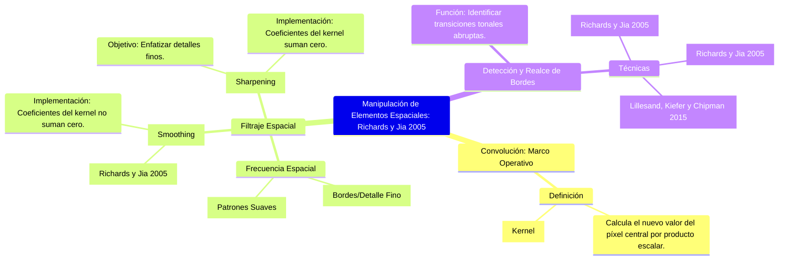

## **Manipulación de Elementos Espaciales en el Procesamiento Digital de Imágenes de Teledetección**

### Introducción

El procesamiento digital de imágenes de teledetección (PDI) requiere la aplicación de métodos avanzados para mejorar la calidad visual o extraer información temática específica. Dentro de este marco, la **manipulación de elementos espaciales** se enfoca en modificar la información tonal (valores de brillo) de los píxeles en función de los valores de sus píxeles vecinos. Esta clase de técnicas, fundamentalmente el **filtrado espacial** a través de la **convolución**, permite el realce o la atenuación de las características estructurales del terreno.

A continuación, se presenta un análisis formal de la convolución, las técnicas de filtraje y la detección y realce de bordes, entendidos como componentes esenciales del realce geométrico y espacial en el análisis de imágenes (Richards y Jia 2005).

### 1. Convolución (Convolution)

La **convolución** es la operación matemática central empleada en el filtrado espacial. En el contexto del PDI, se implementa utilizando una **máscara de convolución** (o *kernel*), que es una matriz de coeficientes ($n \times n$).

El proceso de convolución implica deslizar la máscara sobre la imagen ráster, píxel por píxel, y calcular un nuevo valor para el píxel focal mediante el producto escalar de los coeficientes del kernel y los valores de brillo de la vecindad cubierta (Richards y Jia 2005). La operación de convolución puede expresarse como el producto escalar del vector de entradas de la plantilla y el vector de brillos de los píxeles cubiertos por la plantilla (González y Woods 1992, citado en Richards y Jia 2005, 201). Las técnicas de plantilla forman la base de gran parte del material sobre filtrado espacial (Castleman 1996, Moik 1980, Hord 1982, citados en Richards y Jia 2005, 201).

**Ilustración Conceptual (Figura 1):**

> **Figura 1: Diagrama Esquemático del Proceso de Convolución**
>
> Figura conceptual que ilustra cómo se utiliza un **vecindario rectangular (ej. $3 \times 3$)** para realizar el filtrado espacial, deslizando la ventana secuencialmente a través de la imagen de entrada para asignar un nuevo valor ponderado al píxel focal en la matriz de salida (Conceptualización basada en la Figura 8-18 de Jensen 2015, citado en la respuesta anterior).

### 2. Técnicas de Filtraje Espacial

El **filtrado espacial** busca manipular las características espaciales de la imagen, que se relacionan con la variación tonal o "rugosidad" (frecuencia espacial).

#### 2.1. Filtros de Paso Bajo (Low-Pass Filters)

Los filtros de paso bajo tienen como objetivo **enfatizar las características de baja frecuencia** y **atenuar los componentes de alta frecuencia**, produciendo un efecto de **suavizado** (*smoothing*) en la imagen (Richards y Jia 2005).

*   **Implementación:** Las entradas de la plantilla para el suavizado (filtros de paso bajo) no suman cero. Se utilizan para reducir el ruido o los detalles locales innecesarios (Richards y Jia 2005).

#### 2.2. Filtros de Paso Alto (High-Pass Filters)

Los filtros de paso alto **enfatizan los componentes detallados de alta frecuencia** y **eliminan la información de baja frecuencia**, lo que resulta en el **realce** (*sharpening*) del detalle fino y las discontinuidades (Richards y Jia 2005).

*   **Implementación:** Las entradas de la plantilla para la detección de líneas y bordes (filtros de paso alto) suman cero. El diseño de filtros detallados puede abordarse mediante la teoría de sistemas lineales (Castleman 1996, citado en Richards y Jia 2005, 201).

**Ilustración Conceptual (Figura 2):**

> **Figura 2: Ejemplos de Máscaras de Convolución Comunes**
>
> Figura conceptual que representa diferentes configuraciones de vecindario ($3 \times 3$, $5 \times 5$) y las ponderaciones de coeficientes para filtros de paso bajo (ej. promedio) y filtros de paso alto (ej. realce) (Conceptualización basada en la Figura 8-17 de Jensen 2015, citado en la respuesta anterior).

### 3. Detección y Realce de Bordes

La detección de bordes es una aplicación fundamental del filtrado de paso alto, ya que los bordes representan transiciones tonales abruptas (alta frecuencia).

#### 3.1. Operadores de Primera y Segunda Diferencia

Los operadores direccionales de primera diferencia calculan la diferencia de brillo entre píxeles adyacentes en una dirección específica (Richards y Jia 2005). Estos operadores son cruciales para detectar líneas y límites.

Los **filtros Laplacianos** son un ejemplo de operadores que utilizan la segunda diferencia (Richards y Jia 2005). La intención de diseñar plantillas cuyos coeficientes sumen cero es detectar bordes y líneas (Richards y Jia 2005, 202).

*   **Realce de Bordes Laplaciano:** La aplicación de filtros Laplacianos aísla las variaciones tonales locales, lo que puede sumarse a la imagen original para realzar el detalle fino mientras se mantiene el contexto tonal (Lillesand, Kiefer y Chipman 2015).

**Ilustración Conceptual (Figura 3):**

> **Figura 3: Realce de Bordes mediante Operadores de Diferencia y Laplacianos**
>
> Figura comparativa que muestra: (a) la imagen original, (b) el resultado de un filtro de primera diferencia, y (c) el resultado de un detector de bordes Laplaciano, para ejemplificar cómo estas técnicas aíslan las discontinuidades tonales (Conceptualización basada en la Figura 7.15 de Lillesand, Kiefer y Chipman 2015, citado en la respuesta anterior).

### Conclusión

La convolución sirve como la operación fundamental para manipular la información espacial en el PDI. Mediante la selección de kernels apropiados, se pueden implementar filtros de paso bajo para el suavizado o filtros de paso alto para el realce de estructuras y bordes (Richards y Jia 2005; Jensen 2015). El analista debe comprender las propiedades y características del filtro para elegir kernels y parámetros que optimicen la extracción de información (Richards y Jia 2005, 213).

## Infografía: Manipulación de Elementos Espaciales (Filtraje por Convolución)

| **Componente** | **Definición y Proceso** | **Técnicas Clave** | **Propósito Visual** |
| :--- | :--- | :--- | :--- |
| **CONVOLUCIÓN (Marco Operativo)** | Operación que calcula el nuevo valor de un píxel central mediante un producto escalar de los valores de brillo vecinos y una matriz de coeficientes (kernel). | **Kernel/Máscara:** Matriz $n \times n$ de coeficientes ponderados (Richards y Jia 2005). | Modificación del contenido de **frecuencia espacial** de la imagen (Richards y Jia 2005). |
| **FILTRAJE DE PASO BAJO** (*Low-Pass Filtering*) | Enfatiza la **baja frecuencia espacial** (Richards y Jia 2005). La suma de los coeficientes del kernel generalmente *no* es cero. | **Filtros de Media:** Utilizados para eliminar ruido (Richards y Jia 2005). | **Suavizado (Smoothing):** Reduce el ruido y el detalle fino (Richards y Jia 2005). |
| **FILTRAJE DE PASO ALTO** (*High-Pass Filtering*) | Enfatiza la **alta frecuencia espacial** (Richards y Jia 2005). La suma de los coeficientes del kernel generalmente es cero. | **Filtros de Realce (Sharpening Filters):** Aumentan la claridad de las transiciones tonales (Richards y Jia 2005). | **Realce/Afilado (Sharpening):** Mejora la visibilidad de los límites y detalles finos (Richards y Jia 2005). |
| **DETECCIÓN Y REALCE DE BORDES** | Técnicas especializadas que aíslan las discontinuidades tonales agudas, las cuales son áreas de alta frecuencia. | **Operadores Laplacianos:** Operadores no direccionales de detección de bordes (Richards y Jia 2005). **Primera Diferencia Direccional:** Detecta bordes orientados (Richards y Jia 2005). | Aislamiento y acentuación de bordes y líneas (Richards y Jia 2005). |

## Mapa Mental: Manipulación de Elementos Espaciales
[Editor](https://mermaid.live/edit#pako:eNqdVM1S20AMfhXNntPUSQghvhUCMxQYGNJemnAQXiVZut717E-GwPBAHHrqI_Bi1doBAm1hWl3slaVPn_RpfSsKK0nkolRGllhNDYCzNsAJGlVFjYV6-GlAEuxrKskE62HfV-xGTR4m56pYoJMeVvBZIXSzrH-RMAD2rFlaHZv8yQm6wsJpRQ6DWtp1TLIRzZRRddizswZAXTABIA0m0tLCErV1TEVD9fDjmh8F83HIR3ZXzspYBAvkC9To2i_BvnqEaBBKDE7dpH4Ky4ULxRCpjyNyhvQGrebtQGmucEVPPT8HHDgqIhl2_uFjsk864GbUZNc6Sf7jiAJqTYxtNueQbBevXqacMV1rmOA44pL8b_yeOLIs3NMZeptALEzGJau4UGb-qsTp5RUlBXI4Jx6YcuCikvYtJR_tsKyaHWiWImeJN0aYdPleTxGMBR9LNCyQs6-E-DtvnlfizSQqMm8R3zczXqIbTLtQj9IDr5D17f-k-w5X1ouKZo1XPDTeSkqcGzU32olmXedQcgnFpZghb4_xXLQWMVhT3xq8dLEKuEn4y8N9wbcA_aum04WR1lEzJqdKPsNIzcitN-R92TYwjrFKNxp5WDCmeTTyX8HW_T8DweRYJQnQyBYcKWIwzt5bqCoNtZt1-heiJeZOSZEHF6kluIUS01HcJuypCAuWaSpyfpU0w6jDVEzNHadVaL5ZWz5mOhvnC5HPUHs-xUpioJHCucPyycutSHJ7Npog8s5OjSHyW3Et8m63197qdQb9rL_T6w6zXkusRP5hq50NtreHve3eoLPT7w-Hdy1xU1fN2sPGBllnyDEDhsMY7HhlikdOJFWw7qT5idb_0rtfa2Ox6g)

## Referencias

Gomarasca, Mario A. 2009. *Basics of Geomatics*. Dordrecht: Springer Science+Business Media B.V.

Jensen, John R. 2015. *Introductory Digital Image Processing: A Remote Sensing Perspective*. Boston: Pearson Education, Inc.

Lillesand, Thomas M., Ralph W. Kiefer, and Jonathan W. Chipman. 2015. *Remote Sensing and Image Interpretation*. 7th ed. New York: John Wiley & Sons.

Richards, John A., and Xiuping Jia. 2005. *Remote Sensing Digital Image Analysis: An Introduction*. Berlin: Springer.

Richards, John A. 1984. “Remote Sensing Digital Image Analysis: An Introduction, 5th Ed.” Citado en Richards y Jia 2005, 203.

Swain, P. H., and S. M. Davis, eds. 1978. *Remote Sensing: The Quantitative Approach*. New York: McGraw-Hill. Citado en Richards y Jia 2005, 199. 
