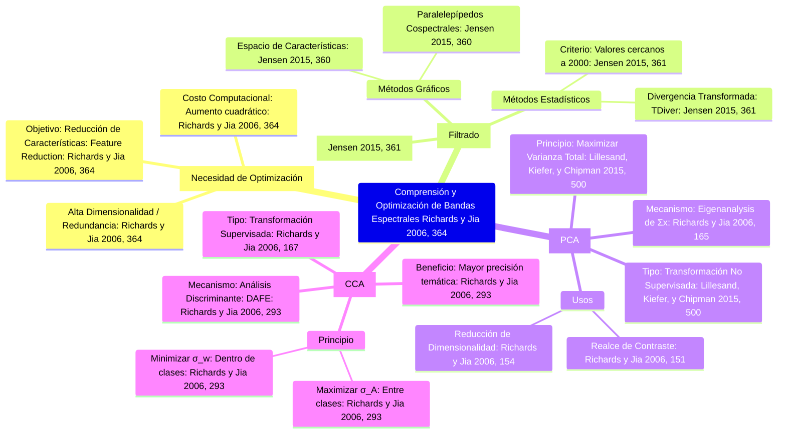

## **Optimización de la Dimensionalidad Espectral en el Procesamiento Digital de Imágenes de Teledetección**

**Resumen**

El procesamiento y análisis de datos de teledetección multiespectrales o hiperespectrales exige estrategias rigurosas para gestionar la alta dimensionalidad y la redundancia inherente de la información (Richards y Jia 2006, 364). Este análisis académico se centra en tres metodologías fundamentales para la optimización de las características espectrales, comúnmente denominadas "comprensión de bandas": la **Selección de Bandas**, el **Análisis de Componentes Principales (PCA, por sus siglas en inglés: Principal Components Analysis)** y el **Análisis de Componentes Canónicos (CCA, por sus siglas en inglés: Canonical Component Analysis)** o Análisis Discriminante (Richards y Jia 2006, 364; 167; Jensen 2015, 361). Estas técnicas buscan sintetizar la información y maximizar la separabilidad entre clases temáticas, mejorando la eficiencia y precisión en la clasificación (Richards y Jia 2006, 364).

### Introducción

La Geoinformación (o Geomática) es una disciplina en rápida expansión que integra técnicas para el estudio de la superficie terrestre, siendo la informática un componente decisivo (Gomarasca 2009, 2). La teledetección, al capturar datos multiespectrales o hiperespectrales, produce vastos volúmenes de datos que a menudo contienen redundancia espectral significativa (Richards y Jia 2006, 364).

La eficiencia económica de los procedimientos de clasificación digital, especialmente algoritmos como la Máxima Verosimilitud (*Maximum Likelihood*), está directamente relacionada con el número de "características" (bandas) utilizadas; el costo aumenta cuadráticamente con la dimensionalidad (Richards y Jia 2006, 364). Por lo tanto, la "comprensión de bandas" se convierte en un proceso esencial que se realiza mediante técnicas de reducción de características (*Feature Reduction*) (Richards y Jia 2006, 364). Estas técnicas permiten concentrar la información original en un número menor de bandas sintéticas, eliminando aquellas características que no contribuyen a la discriminación o separabilidad de las clases espectrales (Richards y Jia 2006, 364).

### 1. Selección de Bandas (*Band Selection*)

La selección de bandas es un proceso crucial que se lleva a cabo en la fase de entrenamiento de una clasificación supervisada (Jensen 2015, 361). El objetivo es identificar el subconjunto óptimo de bandas que maximice la discriminación entre las clases de interés (Richards y Jia 2006, 293).

#### 1.1 Métodos Gráficos: Espacios de Características

Un método fundamental para la selección de características es la visualización gráfica de los datos de entrenamiento en un espacio de vectores multiespectral (o espacio de características) (Jensen 2015, 360). En este espacio, cada píxel se representa como un punto cuyas coordenadas están dadas por su valor de brillo (*Digital Number*, DN) en cada componente espectral (Jensen 2015, 172).

Las **parcelas cospectrales (o elipses)** son herramientas gráficas que ilustran la separabilidad entre clases (Jensen 2015, 360). Estas parcelas utilizan la media ($\mu_{ck}$) y la desviación estándar ($\sigma_{ck}$) de los datos de entrenamiento de cada clase $c$ en cada banda $k$ para definir los límites de las clases. Si las parcelas (por ejemplo, paralelepípedos) de dos clases se superponen, esto indica que la combinación de bandas utilizada no es suficiente para distinguirlas (Jensen 2015, 360).

> **Figura 1. Visualización de Separabilidad en Espacio de Características**
>
> Una ilustración de este método representaría un gráfico de dispersión bidimensional con las estadísticas de entrenamiento de las clases mostradas como paralelepípedos (Jensen 2015, 360). La superposición entre estas áreas demarca la confusión espectral, subrayando la necesidad de utilizar combinaciones de bandas que maximicen la distancia interclase (Jensen 2015, 360).

#### 1.2 Métodos Estadísticos: Divergencia Transformada

Para cuantificar la separación estadística entre los patrones de respuesta espectral de pares de categorías, se utiliza la **Divergencia Transformada ($\text{TDiver}$)**, que es una distancia ponderada por covarianza entre las medias de las categorías (Jensen 2015, 361). Este es un criterio de selección de bandas que evalúa el grado de separabilidad entre clases (Jensen 2015, 361).

La $\text{TDiver}$ escala la divergencia a un rango de 0 a 2000 (Jensen 2015, 361). Un valor máximo (cercano a 2000) indica una gran "distancia estadística" entre los patrones de entrenamiento, lo que se traduce en una alta probabilidad de clasificación correcta (Jensen 2015, 361).

### 2. Análisis de Componentes Principales (PCA)

El **Análisis de Componentes Principales (PCA)**, o Transformada de Karhunen-Loève, es una herramienta de transformación multiespectral utilizada para la reducción de dimensionalidad y el realce de imágenes (Lillesand, Kiefer, y Chipman 2015, 500; Richards y Jia 2006, 141; Jensen 2015, 308). PCA se basa en la estadística global de la imagen y no está diseñado explícitamente para optimizar la estructura de clases (Richards y Jia 2006, 142).

#### 2.1 Principios y Mecanismo

PCA transforma matemáticamente las bandas originales (a menudo correlacionadas) en un nuevo conjunto de bandas (componentes principales) que no están correlacionadas entre sí (Lillesand, Kiefer, y Chipman 2015, 500; Richards y Jia 2006, 142). Esta transformación se logra mediante un análisis de los valores y vectores propios (*eigenanalysis*) de la matriz de covarianza de la imagen ($\Sigma_x$) (Richards y Jia 2006, 165).

Los nuevos ejes de coordenadas se orientan de modo que la varianza de los datos sea máxima a lo largo del primer componente principal (PC1) (Lillesand, Kiefer, y Chipman 2015, 500). Los componentes subsiguientes explican cantidades decrecientes de la varianza total, siendo ortogonales entre sí (Lillesand, Kiefer, y Chipman 2015, 500). Debido a que es una simple rotación de ejes, los valores de brillo resultantes de los píxeles del PCA pueden ser negativos; esto se resuelve trasladando el origen del espacio de componentes principales para obtener componentes con valores de brillo positivos y, por lo tanto, visualizables (Richards y Jia 2006, 150–151).

> **Figura 2. Transformación de Componentes Principales**
>
> Una representación de esta transformación mostraría un diagrama de dispersión de píxeles donde los ejes originales ($X_1$ y $X_2$) son reemplazados por nuevos ejes rotados (PC1 y PC2) (Jensen 2015, 310; Lillesand, Kiefer, y Chipman 2015, 500). El Eje PC1 se extendería a través del eje semimayor de la distribución de los datos, capturando la mayor parte de la varianza total (Jensen 2015, 310).

#### 2.2 Aplicaciones del PCA

El PCA se utiliza en:
1. **Realce de Imágenes y Visualización:** Al asignar los primeros tres componentes principales a los primarios de color, se logra un uso eficiente del espacio de color disponible, aumentando el contraste y reduciendo la redundancia (Richards y Jia 2006, 151–152; Lillesand, Kiefer, y Chipman 2015, 500).
2. **Reducción de Dimensionalidad para Clasificación:** El PCA es una técnica de reducción de características (*feature reduction*). Al reducir el conjunto de datos a la dimensionalidad intrínseca, se mejora la eficiencia del proceso computacional (Richards y Jia 2006, 154; Lillesand, Kiefer, y Chipman 2015, 528).
3. **Detección de Cambios:** En datos multitemporales apilados, la información de cambio significativa a menudo se encuentra en los componentes principales de orden superior, conocidos como componentes de cambio (*change components*) (Jensen 2015, 526; Richards y Jia 2006, 166).

### 3. Análisis de Componentes Canónicos (CCA)

A diferencia del PCA, que es un método no supervisado, el **Análisis de Componentes Canónicos (CCA)**, o **Análisis Discriminante (AD)**, es una transformación supervisada cuyo objetivo principal es maximizar la separación espectral entre las clases predefinidas por el analista (Jensen 2015, 361; Richards y Jia 2006, 167, 293).

#### 3.1 Optimización de la Separabilidad de Clases

El CCA es particularmente apropiado cuando se tiene conocimiento previo sobre las clases de interés. Esta técnica de transformación busca encontrar un nuevo eje de características que cumpla dos objetivos simultáneos (Richards y Jia 2006, 293):
1. Maximizar la separación entre las medias de las clases ($\sigma_A$).
2. Minimizar la dispersión de los datos dentro de cada clase ($\sigma_w$).

El CCA logra una separación óptima al calcular la matriz de dispersión entre clases ($\Sigma_A$) y la matriz de covarianza dentro de clases ($\Sigma_w$). El criterio de optimización consiste en encontrar una matriz de transformación ($D$) que maximice el ratio de la dispersión entre clases y la dispersión dentro de clases.

> **Figura 3. Comparación conceptual entre PCA y CCA**
>
> Un esquema ilustraría la diferencia fundamental: los ejes del PCA (Ejes I y II) se definen por la máxima dispersión de *todos* los datos, sin considerar la identidad de la clase (Lillesand, Kiefer, y Chipman 2015, 500; Richards y Jia 2006, 293). En contraste, los ejes del CCA se definen para separar los grupos de píxeles etiquetados, maximizando la distancia entre las medias de los grupos, lo que lo hace explícitamente sensible a la estructura de la clase (Lillesand, Kiefer, y Chipman 2015, 500).

#### 3.2 Reducción de Dimensionalidad por CCA

El CCA ofrece separabilidad con dimensionalidad reducida (Richards y Jia 2006, 180). Si hay $M$ clases de interés y $N$ bandas de datos multiespectrales, solo habrá $M-1$ ejes canónicos no nulos (Richards y Jia 2006, 180). Por lo tanto, el CCA puede proporcionar la máxima separabilidad temática con una dimensionalidad inferior a la del PCA (Richards y Jia 2006, 180; 139).

La derivación de estos ejes transformados se conoce como **Extracción de Características por Análisis Discriminante (DAFE)** (Richards y Jia 2006, 293). El primer eje canónico (correspondiente al valor propio más grande, $\lambda$) proporciona la máxima separación entre clases (Richards y Jia 2006, 180).

### Conclusiones

Las metodologías de optimización de bandas—Selección de Bandas, **PCA** y **CCA**—son pilares en el análisis cuantitativo. La **Selección de Bandas** (cuantificada mediante la $\text{TDiver}$) minimiza la redundancia (Jensen 2015, 361). El **PCA** ofrece una reducción de dimensionalidad robusta basada en la varianza global, ideal para el realce y la eficiencia computacional (Lillesand, Kiefer, y Chipman 2015, 500; Richards y Jia 2006, 154). Finalmente, el **CCA** proporciona una potente alternativa supervisada que optimiza explícitamente la separabilidad entre las clases de interés, incrementando potencialmente la precisión temática (Richards y Jia 2006, 180).

 

## Infografía: Optimización Espectral para Análisis de Imágenes

| Título Principal | **Optimización de la Dimensionalidad Espectral en Teledetección** (Richards y Jia 2006, 364) |
| :--- | :--- |
| **Objetivo Central** | Reducir la redundancia de datos multiespectrales y maximizar la separabilidad entre clases temáticas (Richards y Jia 2006, 364). |
| **Sección 1: Selección de Bandas (Filtrado de Características)** | **Propósito:** Elegir las bandas originales más informativas (Jensen 2015, 361). |
| **Criterio Gráfico** | **Espacio de Características:** Visualiza la dispersión de píxeles (Jensen 2015, 360). |
| **Criterio Estadístico** | **Divergencia Transformada ($\text{TDiver}$):** Mide la distancia estadística entre pares de clases (rango 0–2000) (Jensen 2015, 361). |
| **Sección 2: Análisis de Componentes Principales (PCA)** | **Propósito:** Transformación **no supervisada** que captura la varianza de los datos en nuevos ejes ortogonales (Lillesand, Kiefer, y Chipman 2015, 500). |
| **Mecanismo** | **Análisis de Varianza Global:** Rota los ejes (PC1, PC2) para maximizar la dispersión total (Jensen 2015, 310). |
| **Aplicaciones Clave** | 1. **Reducción de Dimensionalidad** (Richards y Jia 2006, 154). 2. **Realce de Contraste** (Richards y Jia 2006, 151). |
| **Sección 3: Análisis de Componentes Canónicos (CCA)** | **Propósito:** Transformación **supervisada** que optimiza la separabilidad de clases temáticas (Richards y Jia 2006, 167; 293). |
| **Mecanismo** | **Análisis de Estructura de Clases:** Maximiza la dispersión *entre* clases ($\sigma_A$) y minimiza la dispersión *dentro* de clases ($\sigma_w$) (Richards y Jia 2006, 293). |
| **Resultado** | **Dimensionalidad Reducida Óptima:** Genera hasta $M-1$ ejes canónicos para $M$ clases (Richards y Jia 2006, 180). |

## Mapa Mental: Comprensión y Optimización de Bandas Espectrales
[Editor](https://mermaid.live/edit#pako:eNqVVcFy2zYQ_RUMzqpLSpZk8aZQcmfSOvHYTg61Mpk1sJI3QwIcAHQte3zql2R6yiGnfILu6S91QUaS41ijVAeNKO6-9_DeAriXymqUmSzJ6BKqmREit2Xl0HhafTFiKV5XgUq6A9U8axQvwGjwYuorVMFBgV6ckboGpz2XvyQQ3SQZdERvcBjhhGi_c2sC3gYrLl-hQk8adET7Dv5dWyrEuAggJlRGGdZA0VT_Ks5Q10xuFEG2hzQSemaLq6kDw0eYTIxrxuS_VQ3arT4GUnY_0uurDxjoJlayALVxIgcHKqBbffYMBD4TxwihdtjWBebMfsqbcyxQPTX48pgK9lfbjSsTnJOhpi4T0wIX5ISvr5Q1H-q4qNWXaKaNGFcthnW0INNkdPmSzUTDAtJ-FJBuYE9Wn4LV1ovf2JE5O-LXb0RMOXr3_GqfICbbtlOIg1FgtfpcYYTmMDbjsrtxo2TqA-iW6LGaCd2gW2DMX1w4MH5uXQmah-GiefUDcrrtzR2xeOIQ30JhHTui0CkwzNakkjzX3LaPzepjQZ58YwMPlDU8RIxw6oi1VK2_p_l4Y-kFVUy0ldhm-8qK87pCd0O-Ef0HFdzJSXXE74RzdB0ekvyaqhLWKvrJ1hxkteRLBp4SmwCc6_KbqK__3O6YtHTQXwN8UxstOIHbZtc5NsMRmDv204a4Qf6fpjf-cTxnCIXC1iTDWfuAu1T108dtjzfVk12_E-Bwbzo5GMaMEyQu873hfJfMDiuHz2SxpZ-QV45t5WTiwifj4-kOpO6o90MoWz-24fz79_sxp81eolAF-Lh39gFyPx8Sm_6_WAjb4Zot_LMYL9DwUaPaSVlaJ_hCUNTeCAHL5tyE3TCyIxeOtMyCq7EjS2ST46O8jwQzGa6xxJnM-KfGOdRFmMmZeeC2Csyf1pbrTmfrxbXM5lB4fqorDQEnBAsH2xI0Gl1u-QCUWXrUQMjsXt7KrNvtHRz20mE_6R_1uqOk15FLmf1yeJAMB4NRb9Abpkf9_mj00JF3DWlyMGo_wyQdcc2Q4aAO9nxp1JoPNQXrTtpbs7k8H_4DgCNfSA)
