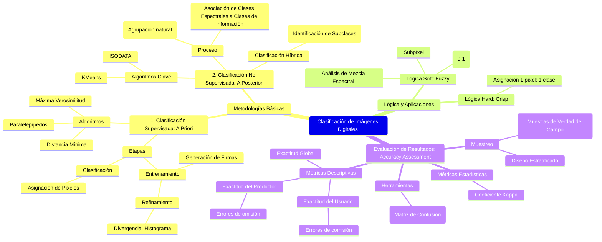

## Clasificación de Imágenes Digitales

La Clasificación de Imágenes Digitales es un componente fundamental en la teledetección (o percepción remota) y las ciencias geomáticas, cuyo objetivo primordial es reemplazar la interpretación visual de datos con técnicas cuantitativas para **automatizar la identificación de características en una escena** (Gomarasca 2009). Este proceso analítico categoriza sistemáticamente cada píxel en una imagen digital en una de varias clases temáticas, como uso o cobertura del suelo (Gomarasca 2009; Richards and Jia 2006).

La clasificación se basa en el **reconocimiento de patrones espectrales**. Cada píxel se describe mediante un vector en un espacio multispectral cuyas coordenadas están dadas por su valor de brillo (Número Digital o DN) en cada banda espectral (Gomarasca 2009). Se espera que los píxeles que representan el mismo material terrestre (clase de información) formen agrupaciones o cúmulos (clases espectrales) en este espacio multidimensional.

A continuación, se examinan las metodologías clave de clasificación y la evaluación de sus resultados bajo un estándar formal.

### 1. Clasificación Supervisada

La Clasificación Supervisada es un enfoque cuantitativo en el que el analista guía el proceso de categorización, empleando su conocimiento *a priori* de la zona de estudio para definir clases de interés (Richards and Jia 2006, 193).

#### 1.1. Metodología y Conceptos Clave

El proceso consta de tres etapas fundamentales: entrenamiento, clasificación y salida (Richards and Jia 2006, 193).

1.  **Etapa de Entrenamiento (Training Stage):** El analista identifica **áreas de entrenamiento** representativas y homogéneas para cada clase temática (e.g., bosque, agua). A partir de estas áreas, se genera una descripción numérica de las **clases espectrales**. Los parámetros estadísticos calculados (vectores de medias, matrices de covarianza, desviaciones estándar) conforman la "firma" de interpretación numérica para cada clase (Richards and Jia 2006, 193).
2.  **Etapa de Clasificación (Classification Stage):** El algoritmo compara el vector de medición de cada píxel desconocido con las firmas de las clases de entrenamiento. El píxel se etiqueta con la categoría a la que más se asemeja numéricamente.
3.  **Etapa de Salida (Output Stage):** Se presentan los resultados, típicamente como mapas temáticos o archivos de datos digitales.

El éxito de la clasificación supervisada depende de la calidad de las áreas de entrenamiento. El **refinamiento del conjunto de entrenamiento** incluye el análisis de la distribución de respuesta espectral y el uso de medidas de distancia estadística, como la **Divergencia Transformada**, que cuantifican la separación entre clases (Gomarasca 2009).

Los algoritmos supervisados más utilizados incluyen:

*   **Máxima Verosimilitud (Maximum Likelihood Classifier, MLL):** Este es un clasificador paramétrico que minimiza el error de clasificación, asumiendo que las clases están distribuidas normalmente (Richards and Jia 2006, 194). Utiliza el vector de media y la matriz de covarianza de la clase para calcular la probabilidad de pertenencia de un píxel (Richards and Jia 2006, 194).
*   **Clasificador de Paralelepípedos (Parallelepiped Classifier):** Define los límites de una clase mediante umbrales (típicamente $\pm 1$ desviación estándar) para cada banda espectral (Gomarasca 2009).
*   **Distancia Mínima a la Media (Minimum Distance to Means Classifier):** Asigna un píxel a la clase con la distancia euclidiana más corta a su vector de media (Richards and Jia 2006).

    **Figura Ilustrativa 1: Paralelepípedos de Clases en el Espacio Espectral**
    
    Esta figura ilustra cómo los límites superior e inferior de las áreas de entrenamiento (generalmente definidos por desviaciones estándar) establecen paralelepípedos en el espacio multispectral. Es una herramienta clave en la clasificación supervisada para visualizar la superposición espectral entre clases.
    
    (Adaptado de Gomarasca 2009, Plate 30c)

### 2. Clasificación No Supervisada

La Clasificación No Supervisada (*clustering*) es un método para **extraer información de la cobertura terrestre sin conocimiento *a priori*** de las clases (Richards and Jia 2006).

#### 2.1. Metodología y Conceptos Clave

Este método busca agrupaciones naturales (*clusters*) de píxeles en el espacio multispectral. El resultado inicial es un mapa de **clases espectrales**. Posteriormente, el analista debe examinar estos clusters y asociarlos con las **clases de información** (cobertura terrestre, como bosque o agua).

El algoritmo de *clustering* más común es **ISODATA** (Iterative Self-Organizing Data Analysis Technique), que utiliza una distancia mínima entre centros de *clusters* para fusionarlos (Jensen 2015, 362).

#### 2.2. Clasificación Híbrida

Los enfoques híbridos combinan la supervisión del analista con la eficiencia del *clustering*. Un método común es el **clustering guiado**, donde el analista delimita áreas de entrenamiento, aplica un algoritmo no supervisado (como ISODATA) a esas áreas para identificar subclases espectrales (resolviendo la multimodalidad de la clase de información), y luego usa estas subclases en un clasificador supervisado (Gomarasca 2009).

### 3. Evaluación de Resultados de una Clasificación

Una clasificación debe ser evaluada para documentar su precisión y determinar el grado de confianza del mapa resultante (Jensen 2015, 443).

#### 3.1. Matriz de Error (Confusion Matrix)

La **Matriz de Error** es la herramienta fundamental, que compara las etiquetas de clase asignadas por el clasificador (filas) con las clases determinadas por los **datos de referencia** (*ground truth* o verdad de campo) (columnas), obtenidos a través de muestreo independiente (Jensen 2015, 444). Los píxeles clasificados correctamente se encuentran en la diagonal principal (Jensen 2015, 448).

#### 3.2. Métricas de Precisión Descriptivas

La matriz de error se utiliza para calcular métricas clave (Jensen 2015, 448):

1.  **Exactitud Global (Overall Accuracy):** El porcentaje total de píxeles clasificados correctamente (Jensen 2015, 448).
2.  **Exactitud del Productor (Producer’s Accuracy):** Mide la probabilidad de que un píxel de referencia de una clase sea clasificado correctamente. Está relacionada con los **errores de omisión** (Jensen 2015, 449).
3.  **Exactitud del Usuario (User’s Accuracy):** Mide la fiabilidad del mapa desde la perspectiva del usuario (probabilidad de que un píxel clasificado pertenezca realmente a esa clase). Está relacionada con los **errores de comisión** (Jensen 2015, 449).

    **Tabla Ilustrativa 1: Matriz de Error y Métricas Descriptivas**
    
    Matriz conceptual que muestra la relación entre la clasificación obtenida y los datos de referencia (Ground Truth) para derivar métricas de precisión.
    
    (Adaptado de Richards and Jia, Table 7.3)

#### 3.3. Métricas de Precisión Estadísticas

El **Coeficiente Kappa ($\hat{K}$) de Acuerdo** es una medida estadística que evalúa cuánto mejor es la clasificación obtenida en comparación con una asignación puramente aleatoria (Jensen 2015, 451). Incorpora los errores fuera de la diagonal (Congalton 1991, citado en Jensen 2015, 452).

#### 3.4. Clasificación "Blanda" (Fuzzy) y Evaluación

La clasificación tradicional utiliza una lógica "dura" (*hard* o *crisp*), asignando cada píxel a una sola clase. Sin embargo, la clasificación "blanda" (*soft* o *fuzzy*), basada en la teoría de conjuntos difusos (Zadeh 1973), asigna a cada píxel un **grado de pertenencia** (entre 0 y 1) para múltiples clases, reconociendo la existencia de **píxeles mixtos** (Gomarasca 2009, Jensen 2015).

La **Evaluación de Precisión Difusa** utiliza esta lógica para incorporar la posibilidad de que un píxel de referencia pertenezca parcialmente a más de una clase (Gopal and Woodcock 1994, citado en Jensen 2015, 460).

    **Figura Ilustrativa 2: Lógica de Clasificación Hard vs. Soft (Fuzzy)**
    
    Representación conceptual de la clasificación tradicional (Hard) con fronteras discretas frente a la clasificación difusa (Soft), que utiliza grados de pertenencia para modelar píxeles mixtos y transiciones graduales en el terreno.
    
    (Adaptado de Gomarasca 2009, Figuras 9-2 y 9-34)

## Infografía: Clasificación y Evaluación de Imágenes Digitales

| **Elemento Central** | **Clasificación de Imágenes Digitales** |
| :---: | :---: |
| **Objetivo** | Asignar cada píxel a una clase temática utilizando patrones espectrales (Gomarasca 2009). |
| **Tipos de Lógica** | **Hard (Crisp):** 1 píxel = 1 clase. **Soft (Fuzzy):** Grados de pertenencia (0-1) (Zadeh 1973). |

### I. Clasificación Supervisada (Richards and Jia 2006)
| **Definición** | El analista define áreas de entrenamiento *a priori* para generar firmas espectrales. |
| :---: | :---: |
| **Algoritmos Clave** | Máxima Verosimilitud (MLL), Paralelepípedos, Distancia Mínima. |
| **Refinamiento** | Uso de Divergencia Transformada para evaluar la separabilidad de las clases (Gomarasca 2009). |

### II. Clasificación No Supervisada
| **Definición** | El algoritmo identifica cúmulos naturales (*clusters*). El etiquetado de clases es *a posteriori* (Richards and Jia 2006). |
| :---: | :---: |
| **Algoritmo Clave** | ISODATA (Jensen 2015). |
| **Híbridos** | Clustering Guiado (Gomarasca 2009). |

### III. Evaluación de Resultados (Jensen 2015)
| **Herramienta** | **Matriz de Error:** Compara clases del mapa con la Verdad de Campo. |
| :---: | :---: |
| **Métricas Descriptivas** | Exactitud Global (OA). Exactitud del Productor (Errores de Omisión). Exactitud del Usuario (Errores de Comisión). |
| **Métrica Estadística**| Coeficiente Kappa ($\hat{K}$) (Congalton 1991). |

## Mapa Mental (Mermaid Code)
[Editor](https://mermaid.live/edit#pako:eNp1VU1v2zgQ_SsET1nADey4iWPdvLabBF1vjbq7h4UvE3KsEpBIgR9G4iA_Jsc9-LDoT9Af2yEdR5Kb6iSRbx7fzLyhnrgwEnnGS6VlCdVaMzYtwKmNEiBU_UMzieyurF9y1OjYTOXKQ0FvEcnYAr2RpjB5vQfHfq9fHMW5wx5jg_NTslWo0G6VAwkZm7ClVcaqI5yxuYeqCU8r2lvUUCrU3rQ3GLshRbYR-UnZshvL2FfcqGMw627FZ6a2aCkxoaDHbpXzJrdQQht4or_LMXEq142CZb1_QKpNA5oUOeXnS9PRtahfHlQJ7G-0xqlSFcoH2QbMSApEVQTda9VVtARLDSiwqvcVyob54qdi_2l-qrdxHk9qvrRGoDPdpEPC6ZydTXIbqldCDT7Q4b-1sRNnSOhbDaIEcsfcVSi8TU6B42J0kt4YalOCv1emCN1im_9u9WU2-TZpL31eIOhWRU_Svq3391ZJ-EVGN0GBNOzsTpIruj5fhXuRpL5m-Ef9I6d99sgmVZGARjftPe7egpUZm1rlqlZKLWsMWJWckdFb4j9lWJmNz9insNs9vs9QGctubJQdbYbWk_WTP876HwatdlACh6NaNLp-KZRTqfwL3JGApjuvfp5voQhNGb6iC4Wn0xx5RghquaAKOKqLK6lmR-5btPYwW-2xW4C3ahdp5taS7LNmYWr0Jrh4ypvkRUBHA95y3zdaiG1aKkrDUXhCQJJPAyNBJiooK9NKnCYG6_8MZUbYQ1flG-mi_pck0L3EZuiEVZVX27bk-QMIH2eQ3RTmHor3diQWcVJkEN7Y7i2Q8jzY25TKda3dZfjLBaDxY78kEKcMjXZKDWS9p-qItvipoTtOxC4g-wxVBYz3eE7-55m3AXu8RBq4-MmfYtSa--9Y4ppn9CpxA9TqNV_rZwqrQP9jTHmMtCbk33m2gcLRV6gkeJwpiHfkGwS1RDs1QXueDa4TBc-e-APPLi6G5x-Hg9Fl__J6eDHuD3v8kWcfPp73R1dX4-HVcDS4vrwcj597fJcO7Z-PD8-oPxgTZkR0ELxZPWpxPA-lovovDv-s9Ot6_h9hIDHt)

## Bibliografía

Anderson, J. R., E. Hardy, J. Roach, and R. Witmer. 1976. *A Land-Use and Land-Cover Classification System for Use with Remote Sensor Data*. Washington: U.S. Geological Survey, Professional Paper #964.

Congalton, Russell G. 1991. "A Review of Assessing the Accuracy of Classifications of Remotely Sensed Data." *Remote Sensing of Environment* 37: 35–46.

Gomarasca, Mario A. 2009. *Basics of Geomatics*. B.V.: Springer Science+Business Media.

Gopal, Sucharita, and Curtis Woodcock. 1994. "Theory and Methods for Accuracy Assessment of Thematic Maps Using Fuzzy Sets." *Photogrammetric Engineering & Remote Sensing* 60 (2): 181–188.

Jensen, John R. 2015. *Introductory Digital Image Processing: A Remote Sensing Perspective*. 4th ed. Boston: Pearson Education, Inc.

Richards, John A., and Xiuping Jia. 2006. *Remote Sensing Digital Image Analysis: An Introduction*. 4th ed. Berlin: Springer-Verlag.

Zadeh, Lotfi A. 1973. "Fuzzy Pattern Recognition." En *Fuzzy Pattern Recognition*, editado por Lotfi A. Zadeh. London: Academic Press.
