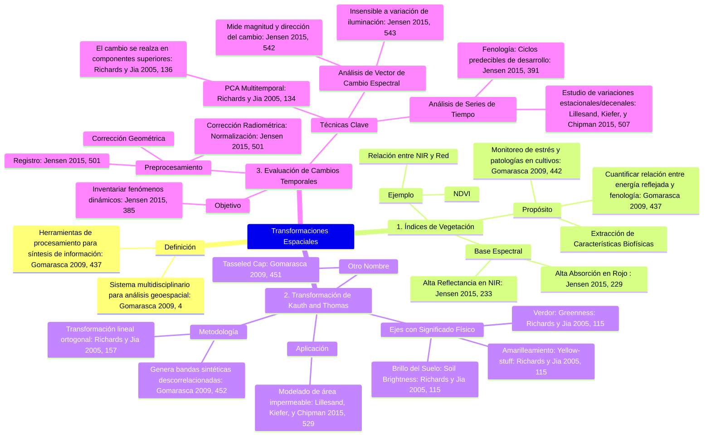

## **Transformaciones Espaciales en el Procesamiento de Imágenes de Teledetección**

La Geomática se define como un enfoque sistémico, multidisciplinario e integrado que abarca la selección de instrumentos y técnicas adecuadas para la recolección, almacenamiento, integración, modelado, análisis, transformación, visualización y distribución de datos georreferenciados espacialmente, provenientes de diversas fuentes y en formato digital (Gomarasca 2009, 2, 4). Dentro del vasto campo del análisis de imágenes digitales de teledetección, las transformaciones espaciales y espectrales desempeñan un papel fundamental para reducir la redundancia, sintetizar la información contenida en los datos originales y extraer información temática específica sobre la superficie terrestre (Gomarasca 2009, 437; Richards y Jia 2005, 138).

El presente análisis se centra en tres aplicaciones clave de estas transformaciones: los Índices de Vegetación (IV), la Transformación de Kauth and Thomas (Tasseled Cap) y la Evaluación de Cambios Temporales.

### 1. Índices de Vegetación (IV)

Los Índices de Vegetación (IV) son algoritmos basados en la relación cuantitativa entre bandas espectrales que permiten definir las relaciones entre la energía reflejada y la fenología de la vegetación (Gomarasca 2009, 437). Estos índices se utilizan para cuantificar las características biofísicas de la vegetación (Jensen 2015, 487).

#### Fundamento Espectral
La vegetación es una de las clases más sencillas de distinguir mediante la teledetección debido a su respuesta espectral típica (Gomarasca 2009, 437). El comportamiento espectral de las diferentes especies varía en función de la estructura de las plantas y de sus hojas (Gomarasca 2009, 437).

La vegetación sana y vigorosa exhibe consistentemente una baja reflectancia en la porción roja (Red) del espectro visible (aproximadamente 0.6–0.7 $\mu m$) debido a la absorción de la luz roja por la clorofila para la fotosíntesis, y una alta reflectancia en el infrarrojo cercano (NIR) (aproximadamente 0.7–0.9 $\mu m$) (Jensen 2015, 206, 229, 233). Por ejemplo, el pasto Centipede refleja solo entre el 3% y el 4% de la energía roja incidente, pero aproximadamente el 35% de la energía del infrarrojo cercano incidente (Jensen 2015, 229).

#### Aplicaciones y Tipología
El enfoque de los IV busca sintetizar la información contenida en los datos originales para reducir el volumen de datos a procesar, concentrando la información en un número menor de bandas sintéticas (Gomarasca 2009, 442). Los índices se emplean para:

*   **Monitoreo y Evaluación Agrícola:** Monitorear daños a los cultivos debido a infestaciones, patologías y estrés hídrico; y evaluar y monitorear las fases fenológicas para la ideación de modelos agro-meteorológicos (Gomarasca 2009, 442).
*   **Detección Ambiental:** La vegetación puede actuar como un indicador superficial y subsuperficial de la modificación ambiental (Gomarasca 2009, 437).

Uno de los índices más conocidos es el **Índice de Vegetación de Diferencia Normalizada (NDVI)**, que se calcula típicamente como la diferencia entre la reflectancia NIR ($\rho_{NIR}$) y la reflectancia Red ($\rho_{R}$), normalizada por su suma, lo que resulta en una métrica relacionada con la densidad de la vegetación verde (Jensen 2015, 327, 508).

Otros índices que utilizan relaciones espectrales incluyen:
*   **Índice de Área Quemada (BAI)** (Martin 1998): Relaciona las bandas Red e IR (Gomarasca 2009, 451).
*   **Índice Urbano (UI)** (Kawamura et al. 1996): Utiliza las bandas SWIR y NIR (Gomarasca 2009, 451).
*   **Índice de Vegetación Transformado (TVI)** (Myers 1983): Una transformación del índice de vegetación (Richards y Jia 2005, 287).

### 2. Transformación de Kauth and Thomas (Tasseled Cap)

La Transformación de Kauth and Thomas (Kauth and Thomas 1976), también conocida como **Tasseled Cap** (TCT), es una transformación lineal que se aplica a datos multiespectrales, como los de Landsat TM (Crist y Cicone 1984), para generar bandas sintéticas cuyo contenido de información está descorrelacionado y posee un significado físico específico (Gomarasca 2009, 451–452; Richards y Jia 2005, 156–157).

A diferencia del Análisis de Componentes Principales (PCA), que genera ejes de variación máxima estadística, la TCT es específica para la aplicación agrícola, diseñando nuevos ejes ortogonales para maximizar la información de importancia en este sector (Richards y Jia 2005, 157, 113, 115).

#### Significado Físico y Desarrollo Fenológico
La TCT se basa en la observación del comportamiento espectral-temporal del desarrollo de los cultivos agrícolas, el cual puede resumirse en un espacio tridimensional (Gomarasca 2009, 452; Richards y Jia 2005, 158).

**Figura Ilustrativa del Concepto Tasseled Cap:**

> **Figura conceptual de la Transformación Tasseled Cap (TCT):** La TCT resume la modificación temporal de la reflectancia espectral de un ciclo de cultivo. Se identifican tres direcciones ortogonales: la diagonal principal, a lo largo de la cual se distribuyen los suelos, está representada por el eje de la **Brillo del Suelo** (*Soil Brightness*); el desarrollo de la biomasa hasta un máximo sigue el eje de la **Verdor** (*Greenness*); y el amarilleamiento de los cultivos tiene lugar en un eje ortogonal a la línea del suelo y el retorno a la respuesta del suelo desnudo (*yellow staff*) (Kauth and Thomas 1976).

Se identifican tres direcciones ortogonales principales significativas en la agricultura (Richards y Jia 2005, 159):

1.  **Brillo del Suelo (Soil Brightness):** Es la diagonal principal a lo largo de la cual se distribuyen los suelos, formando el borde y la base del "capuchón" (Gomarasca 2009, 452; Richards y Jia 2005, 114, 115).
2.  **Verdor (Greenness):** Eje ortogonal al brillo del suelo. Sigue el desarrollo de la biomasa verde a medida que los cultivos avanzan hacia la madurez, y se utiliza como un indicador de verdor (Richards y Jia 2005, 159).
3.  **Amarilleamiento (Yellow-stuff / Yellowness):** Un tercer eje ortogonal que mide el amarilleamiento del cultivo (senescencia) (Richards y Jia 2005, 159).
4.  **No-tal (Non-such):** Un cuarto eje es necesario para dar cuenta de la varianza de los datos no asociada sustancialmente con las diferencias en el brillo del suelo o la vegetación (Richards y Jia 2005, 159).

Durante el ciclo de crecimiento, la trayectoria de los cultivos converge hacia la corona del capuchón en la madurez, y luego se pliega hacia el amarilleamiento, volviendo finalmente a varias posiciones de suelo, formando los "tassels" (borlas) (Richards y Jia 2005, 114).

#### Aplicaciones Específicas
Además del análisis agrícola, la TCT se ha adaptado a otras aplicaciones. Por ejemplo, el componente *Greenness* derivado de la TCT de datos Landsat TM se ha relacionado empíricamente con la cantidad de vegetación verde para medir el **área de superficie impermeable** en zonas urbanas o desarrolladas, indicando la falta relativa de vegetación (Lillesand, Kiefer, y Chipman 2015, 529). Además, la diferencia de transformaciones TCT de múltiples fechas (cambios en brillo, verdor y/o humedad) es una técnica ampliamente adoptada para la detección de cambios (Jensen 2015, 519).

### 3. Evaluación de Cambios Temporales

La evaluación de cambios temporales (Change Detection) es crucial en la teledetección para inventariar materiales biofísicos y características antrópicas dinámicas en la superficie terrestre, lo que facilita una comprensión más completa de los procesos físicos y humanos subyacentes (Jensen 2015, 501, 385). Este proceso requiere el preprocesamiento de imágenes de múltiples fechas, incluyendo corrección geométrica (rectificación o registro) y corrección radiométrica (normalización) (Jensen 2015, 501, 513; Richards y Jia 2005, 316).

#### 3.1. Detección de Cambios mediante Análisis de Componentes Principales (PCA)
La Transformación de Componentes Principales (PCA) es una técnica de reducción de redundancia que genera un nuevo conjunto de variables descorrelacionadas, donde el primer componente contiene la mayor parte de la varianza, y los componentes subsiguientes contienen porciones cada vez menores (Richards y Jia 2005, 134, 401).

Cuando se aplica PCA a un conjunto de datos multitemporales y multiespectrales (apilados en una única capa), se utiliza para mejorar las regiones de cambio localizado (Richards y Jia 2005, 134). Este método se basa en la alta correlación que existe entre los datos de imagen para las regiones que *no cambian* significativamente, y la correlación relativamente baja asociada con las regiones que *cambian* sustancialmente (Richards y Jia 2005, 134).

Si la mayor parte de la varianza se asocia con tipos de cobertura constante, las regiones de cambio localizado se realzarán en los componentes **superiores** del conjunto de imágenes transformadas (Richards y Jia 2005, 134, 136). Mientras que las variaciones asociadas con los tipos de cobertura constante se mapean a un pequeño rango de brillo en los componentes principales superiores, el efecto de cambio dominará estos componentes (Richards y Jia 2005, 136).

**Figura Ilustrativa del PCA para Detección de Cambios (Concepto de Realce):**

> **Figura 7.27:** Uso del análisis de componentes principales para aumentar el contraste de una columna de humo con las áreas terrestres y acuáticas subyacentes. (c) Tercer componente principal de imágenes derivado de las bandas MODIS 1–5 y 8. La columna de humo es muy aparente, ayudando a aumentar el contraste entre la columna y las superficies subyacentes (Lillesand, Kiefer, y Chipman 2015, 527).

#### 3.2. Análisis del Vector de Cambio Espectral (Spectral Change Vector Analysis - CVA)
El Análisis del Vector de Cambio Espectral (CVA) es un algoritmo de detección de cambios que produce una imagen que incorpora la magnitud y la dirección del cambio, utilizando las bandas espectrales (Jensen 2015, 542).

En un espacio multiespectral bidimensional (por ejemplo, NIR vs. Red), el vector de cambio de un píxel se define por la magnitud del cambio (distancia en el espacio) y el ángulo de cambio ($\theta$) entre las reflectancias del Píxel 1 (Fecha 1) y el Píxel 2 (Fecha 2) (Jensen 2015, 542).

La **magnitud del cambio** ($CM_{pixel}$) se calcula utilizando la raíz cuadrada de la suma de los cuadrados de las diferencias de reflectancia en cada banda (por ejemplo, Red y NIR) (Jensen 2015, 542, Ecuación 12.11). La **dirección del cambio** se calcula mediante la función arcotangente (Jensen 2015, 542, Ecuación 12.12).

El CVA genera una única imagen de información de cambio que es insensible a la variación de la iluminación (Jensen 2015, 542, 543). Esto es una ventaja clave. La decisión de que ha ocurrido un cambio se toma si la magnitud del vector excede un umbral preestablecido (Virag y Colwell 1987; Jensen 2015, 543). La dirección del vector de cambio contiene información sobre el *tipo* de cambio (por ejemplo, el vector de cambio debido a la tala debería ser diferente al vector de cambio debido al rebrote de la vegetación) (Jensen 2015, 543).

**Figura Ilustrativa del Análisis del Vector de Cambio Espectral:**

> **Figura 12-35:** Diagrama esquemático del método de detección de cambios por Análisis del Vector de Cambio Espectral. (a)-(d) Muestra la magnitud y el ángulo del vector de cambio en un espacio bidimensional. (e) Muestra los posibles códigos de sector de cambio para un píxel medido en tres bandas en dos fechas (Jensen 2015, 542).

#### 3.3. Análisis de Series de Tiempo
El acceso a datos globales recolectados sistemáticamente y a largo plazo (por ejemplo, de sensores como MODIS) ha permitido el desarrollo del análisis de series de tiempo (Lillesand, Kiefer, y Chipman 2015, 588, 507). Las series de tiempo de imágenes, o de productos derivados como los índices de vegetación (EVI, NDVI), se utilizan para estudiar variaciones estacionales a decenales en sistemas agrícolas, ecológicos e hidrológicos a escala regional (Lillesand, Kiefer, y Chipman 2015, 588, 508).

Un enfoque en este análisis es el modelado del perfil temporal de la vegetación, donde parámetros como la fecha de emergencia, el momento del pico de verdor y la amplitud del ciclo estacional (fenología) se utilizan para clasificar y modelar, reduciendo la dimensionalidad de los datos originales (Lillesand, Kiefer, y Chipman 2015, 588, 509). La fenología, el estudio de los ciclos predecibles de desarrollo de los ecosistemas, es fundamental para identificar el momento óptimo de recolección de datos de teledetección para obtener la máxima información útil sobre el cambio (Jensen 2015, 508, 391).

### Conclusión

Las transformaciones espaciales en el procesamiento de imágenes de teledetección son herramientas esenciales para el análisis cuantitativo de la superficie terrestre. Los Índices de Vegetación aprovechan el contraste espectral inherente de la vegetación entre las regiones roja e infrarroja para monitorear la biomasa y el estrés. La Transformación de Kauth and Thomas proporciona un marco ortogonal, conceptualmente guiado por la fenología de los cultivos, para sintetizar y descorrelacionar la información multiespectral en términos de brillo, verdor y amarilleamiento. Finalmente, la Evaluación de Cambios Temporales, mediante técnicas como el PCA multitemporal y el CVA, permite la cuantificación y caracterización precisa de los cambios dinámicos a lo largo del tiempo, facilitando la modelización y la gestión de recursos a diversas escalas (Gomarasca 2009, 437; Richards y Jia 2005, 134, 157). La integración de estas técnicas es un componente clave de los sistemas de información geoespacial modernos (Lillesand, Kiefer, y Chipman 2015, 591).

## Infografía: Transformaciones Espaciales Clave en Teledetección

| Tema | Concepto Principal | Bases Teóricas y Físicas | Aplicaciones y Ejes |
| :--- | :--- | :--- | :--- |
| **Índices de Vegetación (IV)** | Algoritmos de relación entre bandas espectrales para cuantificar características biofísicas de la vegetación (Gomarasca 2009, 437). | **Respuesta Espectral Típica:** Alta absorción de energía en el rojo (clorofila) y alta reflectancia en el infrarrojo cercano (NIR) (Jensen 2015, 229, 233). | **Monitoreo Fenológico:** Seguimiento de la salud de los cultivos, detección de estrés hídrico y plagas (Gomarasca 2009, 442). |
| **Transformación de Kauth and Thomas (TCT)** | Transformación lineal ortogonal (Tasseled Cap) que genera bandas sintéticas con significado físico, optimizada para la agricultura (Richards y Jia 2005, 157, 115). | **Fenología del Cultivo:** Los ejes se definen para seguir las trayectorias de reflectancia espectral durante el ciclo de crecimiento, desde el suelo desnudo hasta la madurez (Gomarasca 2009, 452). | **Ejes Principales:** 1. Brillo del Suelo (Soil Brightness). 2. Verdor (Greenness). 3. Amarilleamiento (Yellow-stuff). 4. No-tal (Non-such) (Richards y Jia 2005, 159). |
| **Evaluación de Cambios Temporales (ECT)** | Uso de imágenes de múltiples fechas para inventariar y comprender los cambios dinámicos en la superficie terrestre (Jensen 2015, 501, 385). | **Análisis Multitemporal:** Requiere la corrección geométrica y radiométrica de las imágenes para asegurar la comparabilidad (Jensen 2015, 501). | **Técnicas Clave:** **PCA** (el cambio se realza en los componentes superiores) (Richards y Jia 2005, 134). **CVA** (mide magnitud y dirección del cambio, insensible a la iluminación) (Jensen 2015, 543). **Series de Tiempo** (análisis fenológico decenal) (Lillesand, Kiefer, y Chipman 2015, 507). |

## Mapa Mental (Mermaid)
[Editor](https://mermaid.live/edit#pako:eNqVVs1S4zgQfpUunzPZJE4I8Q0CwzKzsFMhRdVOcVGkdiJKllySzA5QPMI-xBw5cOIR_GLbsg0hTpgfH1KxrP767-tPuo-4ERglUSa1yFh-pYGeuWXapcZmjEuj0cGxy-kvU-jqDeE5wlRqyWX5rNeL4bmQzmPGICuUl0I6LnMlNbPSQM4sA6bL70o66WCJBhvkBE5MRl8dZzDo9SYdGG6i_onWskyi9syBQMit4ejqlQbYlU_aYwCm71I3CVB8O8Dj8Rq-34XyPy0k4QXLS1yirw1hM4Yv1uTls5PebK4DHH_zlvHahiCm5Ix7tOWT85JTwIfSpPQS_rdNpwXTXqb0yYJF1TimrCzSL9pl-cToQ6rwmgkGt5CiNsqE5Z_kVT9nRlPAFk0IDJ235aMjlJz5BsWRG-ChWTfG7YAcDjYhD5nDwAjklLNquwM4UJ7BwcIZ-5IKzMy1gQQ-oXb0Nuj1Rx0YDCbv2M5CstwzTcQI1uens7ZtHG_aHl9jlquttpwfXZ6212atGhM6lWOGYr1x0N0Ygaapn1nhV8ReAfMV1ci1yPG3twbOTbaw2HY5Z86hQkG8yHcUeNTfNDhDb0TTnO0StSOj2UKmwFhvlkaHSZpJvmJWhC5_kpUXKll_NN7GOgkEY7CgpCgfJ7UvH2vCCnTc2JqPhEqfdwU-2OqCA240ScBSV5QWBj5WvDfbzg-tVCqwUsFFgcokcGGkCsvLlSfVce9l0h9tg12iFcZSjBZR_67xAeVFsWCjJgn8gxTZvx-cL9L0V4EOSOU426GH9RBSmqEaxKPyu0UGMsvRZsgWChP4K3h31IUOfJaYou2Qr-lK5hl7ofzo7bjEXTi-YapgbxQnW0jjYE5zYGxQ6jY9F9cYJrwd26m-CZpqJckPKUv5nJG8UP8lqXRGfXOt0Yv3R21RxA0t3k5-GojUiOMJmow4ZqlU2xtnuKSzw5qWy1Gv_2PQGRPyFTahIaThUPLuRfx_DDYvH7muOD9V7Aa3PX2ZHsBZkEff1PY9RsTDbeNqLBTwqj1Awkm9V3eVrHFDcBrDkQWuIDZIUul3eRvv7eDt60laHVucZH7NhbVEw-6wziTtzRhNqi8EORPytaBhJuuQ29VrHwZrGtEmJ4nNwOAm0OmVmlIVdLvY3Yxh_JOsLqgs9bE8l6H871SYJpUoELY1vqtrC512tXzROPwhkGP179fGrTfe7erjm9N3KrmiWcktEnjIvQqUpJNZa5RqFy-e9KNOtLRSRIm3BXaijCSAhdfoPni7ivwKM7yKEvorMGXEuqvoSj-QWc70V2OyF0triuUqSlKmHL0VuWAejyRb0h3pdQtqgXZqCu2jpL9fQUTJffQtSgaDuDuM--NRb7QfDya9uBPdRsmHYbc33tubxHvxuL8_Gk0mD53ornLa607qZ9zrT2jPmODoODQXt5q_-EMR7hln9X2yulY-_A94KSWH)

